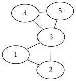

# Definition
[wiki](https://en.wikipedia.org/wiki/Biconnected_component)
在无向图中，
- 点双连通：任意两点之间存在两条“点不重复”的路径。
- 边双连通：任意两点之间存在两条“边不重复”的路径。
- Bi-connected component (BCC) ：点双连通的极大子图。
- Edge-BCC：边双连通的极大子图。

如图所示，图中有两个 BCC ：（1, 2, 3）和（3, 4, 5），但只有一个 Edge-BCC （1,2,3,4,5）。

不难发现：
- 不同的 BCC 可能有公共点；
- 不同的 BCC 最多只有一个公共点，且它一定是割顶；任意割顶至少是两个不同的 BCC 的公共点；
- 每条边恰好属于一个 BCC；
- 每条边要么：
	1. 是 [[割顶和桥|桥]] 
	2. 恰好属于一个 Edge-BCC
