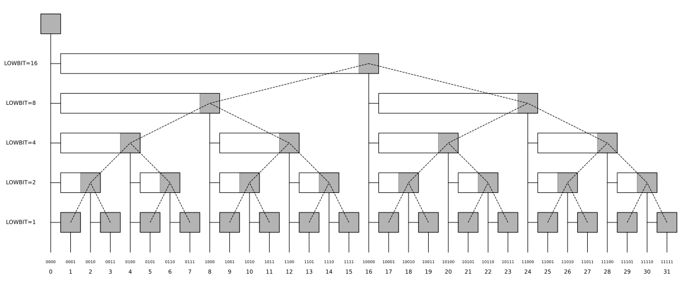
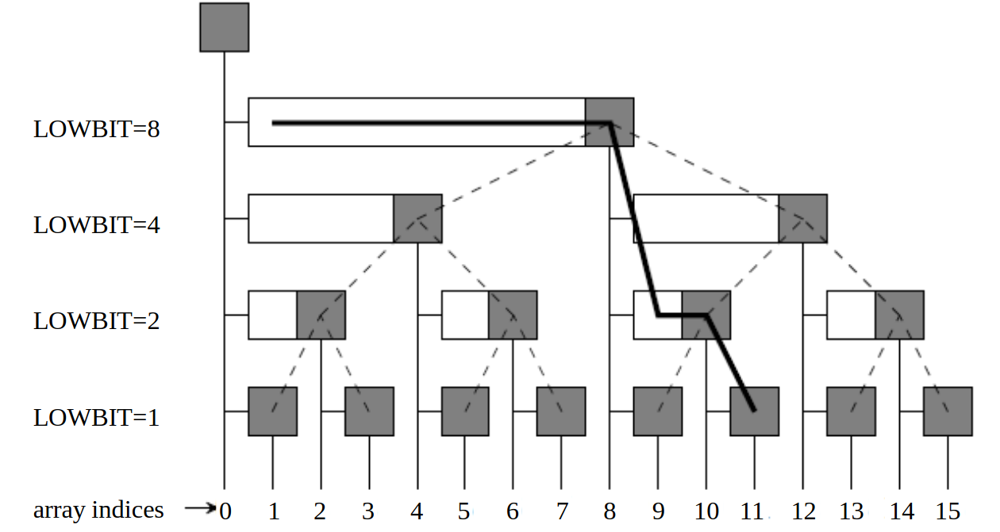
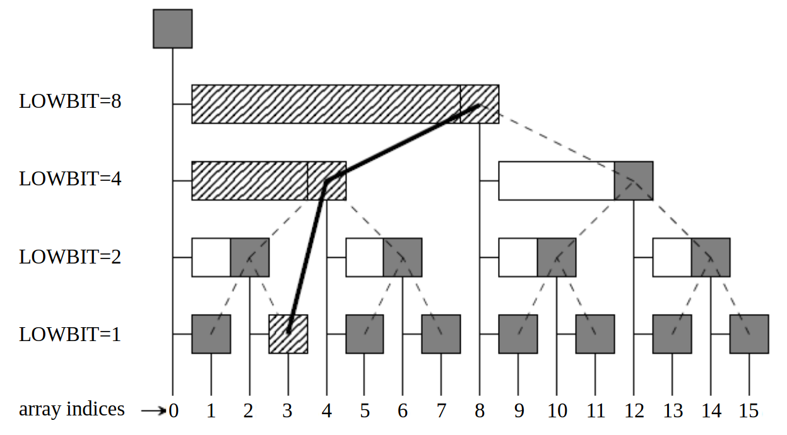

Binary indexed Tree (BIT) 也被称作 [Fenwick Tree](https://en.wikipedia.org/wiki/Fenwick_tree) ，中文翻译为「树状数组」，是一种可以统计前缀和，并支持点更新的数据结构。

时间复杂度：

| 插入          | 查询          | 空间复杂度  |
| ----------- | ----------- | ------ |
| $O(\log n)$ | $O(\log n)$ | $O(n)$ |

# 背景

一个简单的场景，我们需要查询一个数组 $a$ 的区间和 $s[l, r] := \sum_{i=l}^r a_i$ ，如果维护一个前缀和数组 $s_i := \sum_{k < i} a_k$，那么 $s[l, r] = s_r - s_{l-1}$ ，可以在 $O(1)$ 的时间内完成查询。

但是如果我们需要对数组 $a$ 修改某一点的值 $a_p \leftarrow a_p + \delta$ ，此时前缀和数组 $s_i$ 更新的时间复杂度是 $O(n)$，无法接受。

# 原理

树状数组之所以叫作 「树状」，是因为其本质上维护了一个如图所示的隐性完全二叉树：



> 理论上可以认为该二叉树无限大，但在实践中，我们==只考虑 $1\sim n$ 的范围，$0$ 是一个无用下标==，不过在图中也画出来，方便理解。

图中，灰色的节点树中的 node，同时也表示其对应的数组元素 $a_i$ 。对于每一个节点 $i$，我们维护 $c_i$ 表示数组 $a$ 的一段连续和。具体来说，对于每一个下标 $i$，
$$
c_i := s(i - \text{lowbit}(i), i] = \sum_{i - \text{lowbit(i)} < k \leq i}
$$

> 什么是 `lowbit` ？
> 将一个数字写作二进制，`lowbit`就是其最低的非零位表示的数字。
> 数学上，$x = a \times 2^{k+1} + 2^k$，那么 $\text{lowbit(x)} = 2^k$ 。
> 比如：$6 = (110)_2$，那么 $\text{lowbit(6)} = (10)_2$ 。

> 如何快速计算 `lowbit`？
> 对于整数类型的整数 `x`，`-x = !x + 1` ，通过将 `x` 取反再加一，我们可以得到其 `lowbit`。
> 例如： $6 = (000..00110)_{2}$ ，那么 $!6 = (111..11001)_{2}$，$!6 + 1 = (111..11010)_{2}$，接着 $6 \& (!6 + 1) = (0000..00010)_{2}$ 。

# 性质

一切的精髓就在于这棵树，它有非常多美妙的性质，这里简单说几个。


1. 下标 $x$ 的层数，取决于 $\text{lowbit}(x) = 2^k$，那么 $x$ 位于第 $k$ 层（从下往上数）；
2. 第 $k$ 层的节点 $x$ 维护 $c_x := s(x-2^k, x]$ ；
3. 第 $k$ 层的节点 $x$ 的左右儿子，设 $x = a \times 2^{k+1} + 2^k = (a100..)_2$ ，
	1. 其左子树中的节点是 $\{ a\times 2^{k+1} + b = (a0b)_2 : 1 \leq b < 2^k\}$；
	2. 左儿子是 $a\times 2^{k+1} + 2^{k-1} = (a0100..)_2$； 
	3. 右子树中的节点构成集合 $\{ a\times 2^{k+1} + 2^k + b = (a1b)_2 : 1 \leq b < 2^k \}$；
	4. 右儿子是 $a\times 2^{k+1} + 2^{k} + 2^{k-1} = (a1100..)_2$；
4. 任意两个节点维护的区间，不可能交叉，只可能「包含」或者「分离」；

# 查询

区间查询 $s(l, r] = s_r - s_l$，所以我们只需要查询前缀和 $s_x := \sum_{i \leq x} a_i$ 即可。

如果查询 $s_x$，
$$
\begin{align}
s_x 
& = s(0, x] \\
& = s(0, x - \text{lowbit}(x)] + s(x - \text{lowbit}(x), x] \\
& = s_{x - \text{lowbit}(x)} + c_x
\end{align}
$$

对应到树上，其实就是从节点 $x$ 开始，向左、向上爬，直到爬到节点 $0$ 为止；



# 更新

相比「查询」，更新可能理解起来麻烦一点，理论上，当 $a_x \leftarrow a_x + \delta$，我们需要更新所有的「区间包含 $x$ 的 $c_y$」，可是哪些节点维护的区间包含 $x$ 呢？

首先可以注意到，任意两个节点维护的区间只可能「包含」不可能交叉（这里不证明）。更具体来说，一个节点 $x$ 维护的区间就是其左子树的区间加上其本身。

因此，当我们更新 $x$ 后，只需要向上爬，找到==**第一个**==包含 $x$ 的区间即可。



设 $y$ 是第一个包含 $x$ 的区间，通过观察，包含 $x$ 意味着 $x$ 位于 $y$ 的左子树中，并且 $x$ 向上的过程中，遇到 $y$ 之前 $x$ 一直位于右子树。根据对称性，$x + \text{lowbit}(x) = y$ 。

# 拓展

一般来说，其实 BIT 不仅仅可以维护区间和，只要满足以下几个性质即可：
1. 结合率：$(a \circ b) \circ c = a \circ (b \circ c)$ ；
2. 逆运算：已知 $x \circ y$ 和 $x$，可以求出 $y$ ；

# 代码

BIT 的功能被「线段树」完全包含，但是其仍然有存在的价值，因为其实现极其简单。

```rust
//! This module implements a Binary Indexed Tree (BIT) or Fenwick Tree.
//! It provides methods for updating values and querying prefix sums.
//!
//! # Examples
//! ```
//! # use algo_rs::bit::BIT;
//! let mut bit = BIT::new(4);
//! bit.update(1, 1);
//! bit.update(2, 2);
//! bit.update(3, 3);
//! bit.update(4, 4);
//!
//! assert_eq!(bit.query(1), 1);
//! assert_eq!(bit.query(2), 3);
//! assert_eq!(bit.query(3), 6);
//! assert_eq!(bit.query(4), 10);
//!
//! assert_eq!(bit.query_range(1, 4), 10);
//! ```

use std::ops::{AddAssign, Sub};

/// A Binary Indexed Tree (BIT) or Fenwick Tree implementation.
pub struct BIT<T> {
    c: Vec<T>,
}

impl<T> BIT<T> {
    #[inline(always)]
    fn lowbit(x: usize) -> usize {
        x & (x.wrapping_neg())
    }
}

impl<T> BIT<T>
where
    T: Default + AddAssign + Copy,
{
    /// Creates a new Binary Indexed Tree (BIT) with size `n`, valid index range is `1..=n`.
    pub fn new(n: usize) -> Self {
        Self {
            c: vec![T::default(); n + 1],
        }
    }

    /// Updates the value at index `index` by adding `value`.
    pub fn update(&mut self, index: usize, value: T) {
        let mut i = index;
        while i < self.c.len() {
            self.c[i] += value;
            i += Self::lowbit(i);
        }
    }

    /// Queries the prefix sum from index 1 to `index`.
    pub fn query(&self, index: usize) -> T {
        let mut sum = T::default();
        let mut i = index;
        while i > 0 {
            sum += self.c[i];
            i -= Self::lowbit(i);
        }
        sum
    }
}

impl<T> BIT<T>
where
    T: Default + AddAssign + Sub<Output = T> + Copy,
{
    /// Queries the sum of the range `left..=right`.
    ///
    /// # Panics
    ///
    /// Panics if `left` is greater than `right`, or if `right` is out of bounds.
    /// Also panics if `left` is less than or equal to 0.
    pub fn query_range(&self, left: usize, right: usize) -> T {
        assert!(left <= right, "left should be less than or equal to right");
        assert!(
            right < self.c.len(),
            "right should be less than the length of c"
        );
        assert!(left > 0, "left should be greater than 0");

        self.query(right) - self.query(left - 1)
    }
}

impl<T> From<Vec<T>> for BIT<T>
where
    T: Copy + AddAssign,
{
    /// Creates a Binary Indexed Tree (BIT) from a vector.
    /// Since the BIT is 1-indexed, the first element of the vector is ignored.
    /// The time complexity of this operation is O(n).
    fn from(mut vec: Vec<T>) -> Self {
        let n = vec.len();
        for i in 0..n {
            let j = i + Self::lowbit(i);
            if let Ok([ci, cj]) = vec.get_disjoint_mut([i, j]) {
                *cj += *ci;
            }
        }
        Self { c: vec }
    }
}

#[cfg(test)]
mod tests {
    use super::*;

    #[test]
    fn test_sample() {
        let mut bit = BIT::new(4);
        bit.update(1, 1);
        bit.update(2, 2);
        bit.update(3, 3);
        bit.update(4, 4);

        assert_eq!(bit.query(1), 1);
        assert_eq!(bit.query(2), 3);
        assert_eq!(bit.query(3), 6);
        assert_eq!(bit.query(4), 10);
        assert_eq!(bit.query_range(1, 4), 10);
        assert_eq!(bit.query_range(2, 3), 5);
    }

    #[test]
    fn test_xor() {
        #[derive(Default, Copy, Clone)]
        struct Xor(u32);

        #[allow(clippy::suspicious_op_assign_impl)]
        impl AddAssign for Xor {
            fn add_assign(&mut self, other: Self) {
                self.0 ^= other.0;
            }
        }

        #[allow(clippy::suspicious_arithmetic_impl)]
        impl Sub for Xor {
            type Output = Self;

            fn sub(self, other: Self) -> Self::Output {
                Xor(self.0 ^ other.0)
            }
        }

        let mut bit = BIT::new(4);
        bit.update(1, Xor(1));
        bit.update(2, Xor(2));
        bit.update(3, Xor(3));
        bit.update(4, Xor(4));
        assert_eq!(bit.query(1).0, 1); // 1
        assert_eq!(bit.query(2).0, 3); // 1 ^ 2 = 3
        assert_eq!(bit.query(3).0, 0); // 1 ^ 2 ^ 3 = 0
        assert_eq!(bit.query(4).0, 4); // 1 ^ 2 ^ 3 ^ 4 = 4
        assert_eq!(bit.query_range(1, 4).0, 4); // 1 ^ 2 ^ 3 ^ 4 = 4
        assert_eq!(bit.query_range(2, 3).0, 1); // 2 ^ 3 = 1
    }

    #[test]
    fn test_from_vec() {
        let mut bit1 = BIT::new(4);
        bit1.update(1, 1);
        bit1.update(2, 2);
        bit1.update(3, 3);
        bit1.update(4, 4);

        let bit2 = BIT::from(vec![0, 1, 2, 3, 4]);
        assert_eq!(bit1.c, bit2.c);
    }
}
```