# Suffix tree and suffix array

# How to compute suffix array

# More information: `rank` and `height` 
这里我们给出`rank`和`height`的定义：
- `rank[i]`：后缀 `i` 的排名，即在 `sa` 中的位置；
- `height[i]`：后缀 `sa[i-1]` 和 `sa[i]` 的最长公共前缀长度 LCP。 
从定义我们容易得到：
$$
\text{SA}[\text{rank}[i]] = i
$$
和
$$
\text{height}[i] \equiv \text{LCP} (\text{SA}[i-1], \text{SA}[i])
$$
这里 $\text{LCP}(i, j)$ 定义为后缀 $i, j$ 的最长公共前缀长度。

## How to compute `height`
计算 `height` 的关键是下面的不等式
$$
height[rank[i]] \geq height[rank[i - 1]] - 1
$$
^height

根据该不等式，我们可以从小到大枚举 $i$ ，然后计算 $height[rank[i]]$ ，由于单调性，计算复杂度是 $O(N)$ 。
```rust
fn calculate_rank_and_height(s: &[u8], sa: &[usize])
-> (Vec<usize>, Vec<usize>) {
    let n = s.len();
    // calculate rank
    let mut rank = vec![0; n];
    for i in 0..n {
        rank[sa[i]] = i;
    }
    // calculate height according to:
    // height[rank[i]] >= height[rank[i-1]] - 1
    let mut height = vec![0; n];
    let mut k: usize = 0;
    for i in 0..n {
        let j = sa[rank[i] - 1];
        k = k.saturating_sub(1);
        while s[i + k] == s[j + k] {
            k += 1;
        }
        height[rank[i]] = k;
    }
    (rank, height)
}
```

下面证明不等式 [[#^height]] ：我们设 $h[i] \equiv height[rank[i]]$ 。

[[suffix_array_height.svg]]



如图所示，我们考虑先后缀 $i-1$，它在 SA 中的位置是 $rank[i-1]$，不妨设其在 SA 的上一个字符串是 后缀 $j-1$，即 $rank[j-1] = rank[i-1] - 1$，根据 $height$ 的定义，我们知道 $LCP(i-1, j-1) = h[i-1]$ 。
接下来考虑 后缀 $j$ 和后缀 $i$，显然 后缀 $j$ 比 后缀 $i$ 小 （因为 后缀$j-1$ 比 后缀 $i-1$ 小），并且我们知道 $LCP(i, j) = h[i-1] - 1$ 。
最后，根据 $height$ 和 LCP 的关系 [[#LCP]]：
$$
\begin{align}
h[i-1] - 1
 & = LCP(j, i) \\
 & = \min \left\{height[k] \mid rank[j] < k \leq rank[i] \right\} \\
 & \leq h[i]
\end{align}
$$

# Applications of suffix array

## LCP
