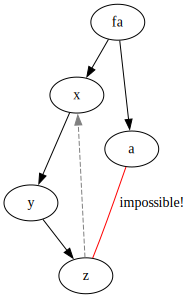
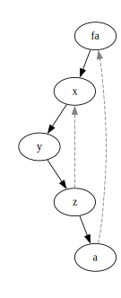

# 定义
对于无向图$G$，
- 如果删除一个节点 $u$ 后，连通分量数目增加，则 $u$ 称之为$G$的割顶；
- 如果删除一条边 $e$ 后，连通分量数目增加，则 $e$ 称之为 $G$ 的桥。

# 算法
核心在于 **DFS 树** 和 **时间戳**。

## DFS Tree

对一个图进行 DFS 遍历，一个节点只访问一次（访问过的不再 DFS），按照访问顺序得到的就是 DFS tree。

DFS tree 的性质：
- DFS tree 构成一颗树，DFS 过程中所使用的边构成 DFS tree 的树边；
- 未使用的边称之为 **反向边**；
- 所有反向边只能由 *后代* 指向 **祖先**，不可能存在树中两个分叉的边。如上图，红色边是不可能存在的，因为遍历第一个分叉的时候一定会走这条边。

由于 DFS tree 的性质，我们可以得到这样的结论：
1. 如果一个节点 $x$ 的后代不存在指向 $x$ 的祖先的反向边，那么 $x$ 和他的父亲 $fa$ 之间的边 $(fa, x)$ 一定是桥。事实上所有的桥都满足这样的性质。
2. 如果 $x$ 有父亲 $fa$，并且 $x$ 的后代不存在指向 $x$ 的祖先的反向边，那么 $x$ 是一个割顶；
3. 如果 $x$ 是根，那么 root 是割顶 当且仅当 root 有多个儿子（分叉）。

现在的问题就变得很简单：如何判断 $x$ 的后代中，是否有反向边指向 $x$ 的祖先？

**时间戳**：在 DFS 遍历过程中，每次访问一个新节点，时间戳增加并赋给这个节点 `index[x]`。
我们给节点增加一个数据 `low_index[x]`，`low_index[x]` 表示 $x$ 所能到达（排除 $(fa, x)$ 这条边）的最小的时间戳。
显然，$x$ 不能到达祖先 当且仅当 `low_index[x] == index[x]` 。