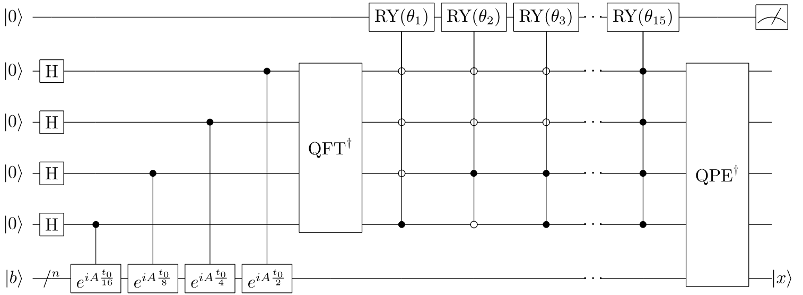

# Key Idea

Given Hermitian $A$ and a unit vector $\vec{b}$, solve the equation $A \vec{x} = \vec{b}$ .

Let $\left| b  \right\rangle = \sum_{j=1}^{N} b_{j } \left| j   \right\rangle$, the key is to simulate $e^{i A \Delta t }$ on $\left| b   \right\rangle$ .

If $A = \sum_{j=1}^{N} \lambda_{j } \left| u_{j} \right\rangle \left\langle u_{j} \right|$, 
then $e^{i A \Delta t } = \sum_{j=1}^{N} e^{i \lambda_{j} \Delta t } \left| u_{j} \right\rangle \left\langle u_{j} \right|$ .
Write $\left| b  \right\rangle$ in the basis $\left\lbrace \left| u_{j} \right\rangle \right\rbrace$ : $\left| b  \right\rangle = \sum_{j=1}^{N} \beta_{j} \left| u_{j} \right\rangle$ .

Using quantum phase estimation, 
$$
e^{i A \Delta t } \left| b  \right\rangle \xrightarrow{\text{QPE}} \sum_{j=1}^{N} \beta_{j} \left| u_{j} \right\rangle | \tilde{ \lambda }_{j } \rangle
$$
where $| \tilde{\lambda}_{j} \rangle$ is the estimation of the eigenvalue $\lambda_{j}$ .

It's trivial that the solution is $\left| x  \right\rangle = A^{-1 } \left| b  \right\rangle = \sum_{j}^{ } \beta_{j } (\lambda_{j})^{-1 } \left| u_{j} \right\rangle$ . 
So we just need to extract the information from $\left| \lambda_{j} \right\rangle$.

# Procedure

## $A$ is not Hermitian

If $A$ is not Hermitian, make a Hermitian $\tilde{A}$ s.t.
$$
\tilde{A} = \begin{pmatrix}
0 & A \\
A^{\dagger } & 0 \\
\end{pmatrix}
$$

And solve the equation 
$$
\tilde{A} \vec{y} = \begin{pmatrix}
\vec{b} \\
0 \\
\end{pmatrix}
$$

The solution $\vec{y}$ must be 
$$
\vec{y} = \begin{pmatrix}
0 \\
\vec{x} \\
\end{pmatrix}
$$
where $A \vec{x} = \vec{b}$.

## Prepare $U = e^{i A \Delta t }$

It's a problem how to simulate $U = e^{i A \Delta t }$. This problem is called simulating quantum system or Hamiltonian. 

If $A$ is sparse, we can efficiently simulate $e^{i A \Delta t }$. Write $A$ in Pauli basis and choose a small $\Delta t$, using Trotter theorem.

## QPE

QPE can estimate the phase $\varphi$ of $U$, where $U \left| u   \right\rangle = e^{2 \pi i \varphi } \left| u  \right\rangle$.

Using $t$ qubits, QPE will act as 
$$
\left| b  \right\rangle \left| 0 \right\rangle^{\otimes t} \left| 0 \right\rangle = \sum_{j=1}^{N} \beta_{j} \left| u_{j} \right\rangle \left| 0 \right\rangle^{\otimes t} \left| 0 \right\rangle 
\xrightarrow{\text{QPE}} \sum_{j=1}^{N} \beta_{j} \left| u_{j} \right\rangle \left| \tilde{\varphi}_{j} \right\rangle \left| 0 \right\rangle
$$

Here $\left| \tilde{\varphi}_{j} \right\rangle$ is the estimation of $\varphi_{j}$. 

For example: 
$A = Z = \left| 0 \right\rangle \left\langle 0 \right| - \left| 1 \right\rangle \left\langle 1 \right|$. $U = e^{i A \Delta t } = e^{i \Delta t} \left| 0 \right\rangle \left\langle 0 \right| + e^{-i \Delta t} \left| 1 \right\rangle \left\langle 1 \right|$. $\varphi_{1} = \Delta t / 2 \pi$ and $\varphi_{2} = -\Delta t / 2 \pi$.

If we choose $t = 4$ and $\Delta t = \pi / 4$, then $\varphi_{1} = 1 / 8$ and $\varphi_{2} = - 1 / 8$. 

The estimation are $\tilde{\varphi}_{1} = 0.0010 \times 16 = 2, \tilde{\varphi}_{2} = 0.1110 \times 16 = 14$ .

Formally, 
$$
\frac{\lambda \Delta t}{2 \pi} =   \varphi = \begin{cases}
\tilde{\varphi} / 2^{t} &  , \varphi > 0 \\
\tilde{\varphi} / 2^{t} - 1 & , \varphi < 0 \\
\end{cases}
$$

## Controlled Rotation

To extract the information from the state $\left| \tilde{\varphi}_{j} \right\rangle$ , we can use the controlled rotation $CR(k)$ which act as 
$$
CR(k) \left| \tilde{\varphi} \right\rangle \left| b \right\rangle = \begin{cases}
\left| \tilde{\varphi} \right\rangle \left| b \right\rangle & ,  k \neq \tilde{\varphi}  \\
\left| \tilde{\varphi} \right\rangle R_y \left( 2 \arcsin \frac{C}{\lambda} \right) \left| b \right\rangle & , k = \tilde{\varphi} \\
\end{cases}
$$

Apply $CR(k)$ from $k = 1, \ldots , 2^{t}-1$. Only act when $k = a$ which means $k = \tilde{\varphi}$. The rotation's effect is simple
$$
\prod_{k=1}^{2^{t} - 1} I\otimes CR(k) \sum_{j=1}^{N} \beta_{j} \left| u_{j} \right\rangle \left| \tilde{\varphi}_{j} \right\rangle \left| 0 \right\rangle
= \sum_{j=1}^{N} \beta_{j} \left| u_{j} \right\rangle \left| \tilde{\varphi}_{j} \right\rangle \left( \sqrt{1 - \left( \frac{C}{\lambda_{j}} \right)^{2}} \left| 0 \right\rangle + \frac{C}{\lambda_{j}} \left| 1 \right\rangle \right)
$$

After the reverse QPE, RHS is 
$$
\left| \psi \right\rangle = \sum_{j=1}^{N} \beta_{j} \left| u_{j} \right\rangle \left| 0 \right\rangle^{\otimes t} \left( \sqrt{1 - \left( \frac{C}{\lambda_{j}} \right)^{2}} \left| 0 \right\rangle + \frac{C}{\lambda_{j}} \left| 1 \right\rangle \right)
$$

## Measurement

Measure the last qubit, when the result is $\left| 1 \right\rangle$, with probability
$$
p_1 = C^{2} \sum_{j=1}^{N} ( \beta_{j} / \lambda_{j} )^{2} 
$$

The post measurement state is 
$$
\left| \psi_{1} \right\rangle = \frac{1}{\left( \sum_{j=1}^{N} \left( \beta_{j} / \lambda_{j} \right)^{2} \right)^{-1}} \sum_{j=1}^{N} \frac{\beta_{j}}{\lambda_{j}} \left| u_{j} \right\rangle \left| 0 \right\rangle^{\otimes t} \left| 1 \right\rangle
$$

$C$ is a parameter that will not change the result, but affect the probability $p_{1}$ . And $C \leq \left\vert \lambda_{j} \right\vert$ can't be too big. 
