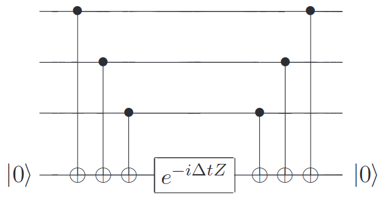
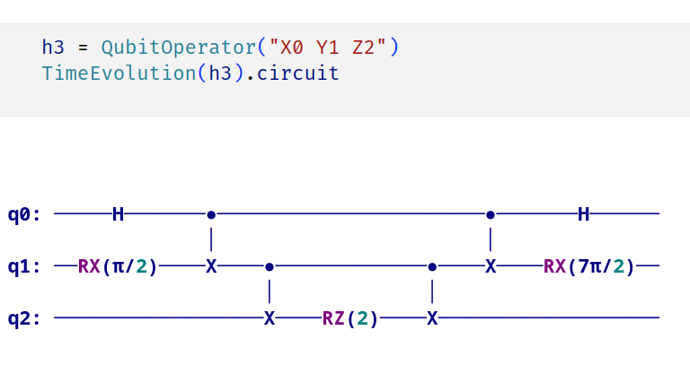

Schrodinger’s equation:
$$
i \hbar \frac{d}{dt} \left| \psi \right\rangle = H \left| \psi \right\rangle 
$$

Move the $\hbar$ into $H$ and the solution is
$$
\left| \psi(t) \right\rangle = e^{-i H t } \left| \psi(0) \right\rangle
$$

In most physical systems, the Hamiltonian can be written as a sum over many local
interactions. Specifically, for a system of $n$ particles, 
$$
H = \sum_{k=1}^{L} H_{k}
$$
where each $H_{k}$ acts on at most a constant $c$ number of systems, and $L$ is a 
polynomial in $n$.

**Lemma**: If $[H_{j}, H_{k}] = 0$ for all $j, k$, then $e^{-iHt} = e^{-i H_{1} t} e^{-i H_{2}t} \cdots e^{-i H_{L}t}$.

**Proof**: $[H_{1}, H_{2}] = 0$, then they can be simutaneously diagnolized as following
$$
\begin{align}
  H_{1} & = \sum_{i=1}^{n} \lambda_{i} \left| i   \right\rangle \left\langle i  \right| \\
  H_{2} & = \sum_{i=1}^{n} \mu_{i} \left| i \right\rangle \left\langle i \right|
\end{align}
$$

Then $H = H_{1} + H_{2} = \sum_{i=1}^{n} \left( \lambda_{i} + \mu_{i } \right) \left| i \right\rangle \left\langle i \right|$.
$$
e^{-i H t} = \sum_{i=1}^{n} e^{-i (\lambda_{i } + \mu_{i})t} \left| i \right\rangle \left\langle i \right| = e^{-i H_{1} t} e^{-i H_{2} t }
$$

**Theorem: (Trotter formula)**
$A$ and $B$ are Hermitian operators. Then for any real $t \in \mathbb{R}$, 
$$
\lim_{n \rightarrow \infty} \left( e^{i A t / n } e^{i B t / n } \right)^n = e^{i (A + B ) t }
$$

**Theorem: (Baker-Campbell-Hausdorf formula)** 
$$
e^{(A + B)t } = e^{A t } e^{B t } e^{- \frac{1}{2} [A, B] t^{2}} + O(t^{3})
$$

**Proof:** 
$$
\begin{align}
  e^{A t } & = I + A t + \frac{1}{2} A^{2} t^{2} + O(t^{3}) \\
  e^{B t } & = I + B t  + \frac{1}{2} B^{2} t^{2} + O(t^{3}) \\
  e^{- \frac{1}{2} [A, B] t^{2}} & = I - \frac{1}{2} [A, B] t^{2} + O(t^{3 })
\end{align}
$$
Then just multiply and compare with $e^{(A + B) t}$.

**Corollary:** 

$$
e^{i (A + B) t } = e^{i A t } e^{i B t } + O(t^{2 }) \\
e^{i (A + B) t } = e^{i A t / 2 } e^{i B t } e^{i A t / 2 } + O(t^{3})
$$

**Proof:** 
$$
\begin{align}
  e^{i (A + B) t } & = e^{i (A + B) t / 2 } e^{i (A + B) t / 2 } \\
  & = \left( e^{i A t / 2 } e^{i B t / 2 } e^{-\frac{1}{2} [A, B] t / 2 } + O(t^{3})\right)
  \left( e^{-\frac{1}{2} [B, A] t / 2 } e^{i B t / 2 } e^{i A t / 2 }  + O(t^{3})\right) \\
  & = e^{i A t / 2 } e^{i B t} e^{i A t / 2 } + O(t^{3})
\end{align}
$$

# Pauli operators

When Hamiltonian is a sum of Pauli operators, simulation is very simple.
$$
H = \sigma_{1}^{c(1 )} \otimes \sigma_{2}^{c(2)} \cdots \otimes \sigma_{n}^{c(n )}
$$

Firstly, consider $H = Z_1 Z_2 \ldots Z_n$, the following figure shows how to do that:

The correctness is tricky. Consider $e^{-i Z t }$.
$$
\begin{align}
  Z & = \left| 0 \right\rangle \left\langle 0 \right| - \left| 1 \right\rangle \left\langle 1 \right| \\
  Z^{\otimes n } & = \sum_{k=0}^{2^n - 1 } \left( -1  \right)^{k_1 \oplus k_2 \cdots \oplus k_n } \left| k \right\rangle \left\langle k \right|
\end{align}
$$

The key is that, when $k$ has even number of 1's, the sign is $-1$, otherwise the sign is $1$. We can use CNOT gate to implement $k_1 \oplus \cdots \oplus k_n$. When even, apply $e^{-i t }$, when odd, apply $e^{i t}$. We can use $e^{- i t Z}$ to implement this. And finally $e^{-i t Z}$ is just a $R_z(2t)$ gate.

Then consider $X$ and $Y$. The key is how to transform $\left| \pm  \right\rangle$ basis and $\left| \pm i  \right\rangle$ basis to standard basis $\left| 0 \right\rangle, \left| 1 \right\rangle$. Just use $H$ gate and $R_x(\pi / 2)$.

